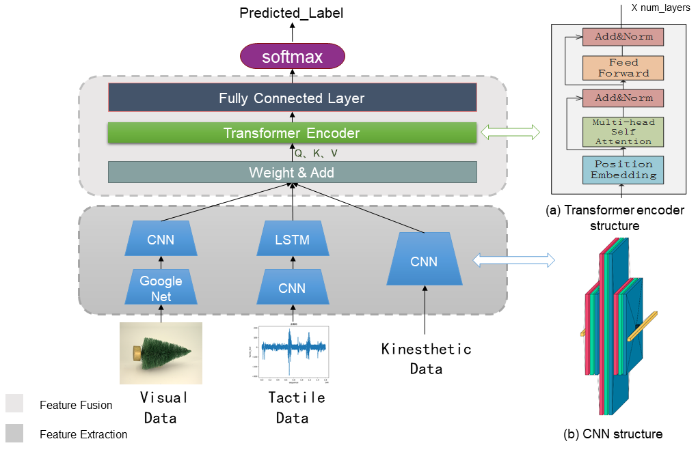
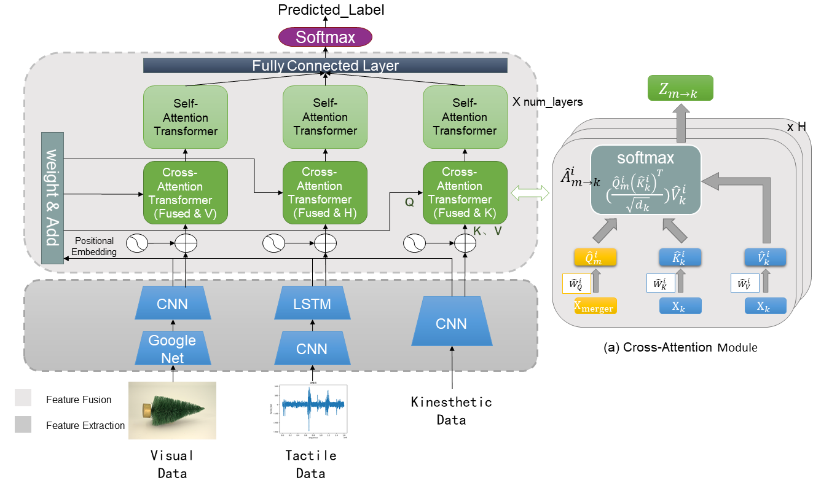

# Description
Title: Visual-Haptic-Kinesthetic Object Recognition with Multimodal Transformer
- CRNN-SA

- CRNN-CA


# Requirements
- python >= 3.7
- scipy
- tensorflow-gpu >= 2.5.0
- Keras >= 2.3.1
- PIL
- pandas

# Datasets
1. Download and unzip the dataset from [AU Dataset for Visuo-Haptic Object Recognition for Robots](https://doi.org/10.6084/m9.figshare.14222486).
2. Run `picenhance.py` to enhance the visual data.
3. Run functions in `Data_make.py` to pre-process the data.
4. You can request the pre-processed data from the author of this article (GitHub:Jokerr-12).

--Notes for getting started--

There is no complicated tuning of parameters for this work, and you can probably adjust the parameters of the network to achieve better results.
# Train and Test
- run CRNN_SA method
```shell
python runtrain.py --epochs 200 --batch_size 8 --model SA
```
- run CRNN_CA method
```shell
python runtrain.py --epochs 200 --batch_size 8 --model CA
```
- test CRNN_SA save_model
```shell
python runtest.py --model SA
```
- test CRNN_CA save_model
```shell
python runtest.py --model CA
```

# Citing this work

@InProceedings{10.1007/978-3-031-44195-0_20,
author="Zhou, Xinyuan
and Lan, Shiyong
and Wang, Wenwu
and Li, Xinyang
and Zhou, Siyuan
and Yang, Hongyu",
title="Visual-Haptic-Kinesthetic Object Recognition with Multimodal Transformer",
booktitle="Artificial Neural Networks and Machine Learning -- ICANN 2023",
year="2023",
publisher="Springer Nature Switzerland",
address="Cham",
pages="233--245",
isbn="978-3-031-44195-0"
}

